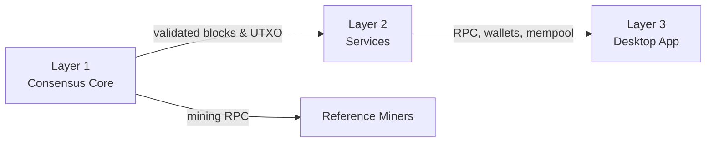

# DRACHMA Blockchain (DRM)

[](https://github.com/Tsoympet/BlockChainDrachma/stargazers)
[](https://github.com/Tsoympet/BlockChainDrachma/network/members)
[](LICENSE)
[](https://github.com/Tsoympet/BlockChainDrachma/actions/workflows/ci.yml)

DRACHMA is a **Proof-of-Work monetary blockchain** designed for long-term stability, auditability, and minimal trust assumptions.

The project focuses on:
- deterministic consensus rules,
- conservative cryptographic design,
- strict separation of system layers,
- and transparent network launch conditions.

This repository contains the **reference implementation** of the DRACHMA network.

---

## Quick Start

```bash
git clone https://github.com/Tsoympet/BlockChainDrachma.git
cd BlockChainDrachma
cmake -S . -B build -DCMAKE_BUILD_TYPE=Release
cmake --build build --parallel
```

- **Dependencies:** CMake (>=3.18), a C++17 toolchain, OpenSSL, Boost, and system libraries required by your platform. GPU miners additionally require **CUDA** or **OpenCL** SDKs.
- **Run a node (example):**
  ```bash
  ./build/layer1-core/drachmad --datadir ~/.drachma --testnet
  ```
- **Run the desktop wallet (Layer 3):**
  ```bash
  ./build/layer3-app/drachma-wallet
  ```
- **Run a reference miner (CPU):**
  ```bash
  ./build/miners/cpu-miner/drachma-cpuminer --rpc http://127.0.0.1:8332
  ```

> Tip: See [`docs/building.md`](docs/building.md) and [`docs/mining-guide.md`](docs/mining-guide.md) for platform-specific details, Docker usage, and troubleshooting.

---

## Usage Examples

- **Start a full node (testnet):**
  ```bash
  ./build/layer1-core/drachmad --datadir ~/.drachma --network testnet --listen --rpcuser=user --rpcpassword=pass
  ```
- **Send a transaction (RPC):**
  ```bash
  curl --user user:pass --data-binary '{"method":"sendtoaddress","params":["<DRM-address>", 1.0]}' \
    -H 'content-type: text/plain;' http://127.0.0.1:8332/
  ```
- **Mine to your node:**
  ```bash
  ./build/miners/gpu-miner/drachma-cuda --url 127.0.0.1:9333 --user user --pass pass --intensity 22
  ```
- **Launch the desktop UI:**
  ```bash
  ./build/layer3-app/drachma-wallet --connect 127.0.0.1:9333
  ```

Commands are subject to change as the implementation matures; prefer scripts in `scripts/` for reproducible setups.

---

## Core Principles

- **Proof-of-Work:** SHA-256d (double SHA-256), unmodified
- **Launch Model:** No premine, no privileged rewards, no special launch logic
- **Supply Cap:** 42,000,000 DRM
- **Consensus First:** All critical rules reside exclusively in Layer 1
- **No Governance Logic:** No voting systems, no administrative keys
- **No Smart Contracts:** Monetary network only

Network neutrality is achieved through **absence of privilege**, not through special enforcement mechanisms.

---

## Architecture Overview

The system is divided into **three strictly separated layers**:



### Layer 1 — Core Blockchain (Consensus-Critical)
Location: `layer1-core/`

Responsibilities:
- Block and transaction validation
- Proof-of-Work (SHA-256d)
- Difficulty adjustment
- UTXO accounting
- Merkle tree construction
- Schnorr signature verification
- Persistent storage (blocks and chainstate)

Changes in this layer require extreme caution and full review.

---

### Layer 2 — Services (Non-Consensus)
Location: `layer2-services/`

Responsibilities:
- Peer-to-peer networking
- RPC interface
- Mempool management and fee policy
- Wallet backend services
- Transaction indexing
- Cross-chain interoperability (proof-based, non-consensus)

This layer must never alter consensus rules.

---

### Layer 3 — Desktop Application
Location: `layer3-app/`

Responsibilities:
- Graphical desktop application
- Wallet interface
- Miner control
- User-facing configuration
- Asset loading (icons, documentation, legal text)

This layer contains no consensus logic.

---

## Launch Characteristics

The network launches without:
- pre-allocation of supply,
- privileged mining phases,
- protocol-enforced launch conditions,
- or embedded checkpoints.

Mining and block production begin normally from the first block.

Launch conditions are documented in:

- [`docs/fair-launch.md`](docs/fair-launch.md)
- [`docs/security.md`](docs/security.md)
- [`docs/whitepaper.md`](docs/whitepaper.md)

---

## Cryptography

- **Proof-of-Work Hashing:** SHA-256d
- **Merkle Trees:** SHA-256d
- **Transaction Hashing:** Tagged SHA-256
- **Digital Signatures:** Schnorr (secp256k1)

Legacy signature schemes are intentionally excluded.

---

## Mining

Reference mining implementations are provided:
- CPU miner
- GPU miner (CUDA)
- GPU miner (OpenCL)

These miners serve as transparent reference tools and are not optimized black-box software. See [`docs/mining-guide.md`](docs/mining-guide.md) for configuration tips, intensity tuning, and monitoring guidance.

---

## Repository Structure

```
drachma-blockchain/
├─ layer1-core/ # Consensus-critical logic
├─ layer2-services/ # Networking, RPC, wallet backend, cross-chain
├─ layer3-app/ # Desktop application
├─ miners/ # Reference CPU & GPU miners
├─ testnet/ # Test network parameters
├─ docs/ # Technical documentation
├─ tests/ # Test skeletons
├─ common/ # Shared utilities
└─ scripts/ # Build and run scripts
```

---

## Roadmap (Proposed)

- ✅ Establish repository structure and CI for skeleton components
- 🔄 Complete Layer 1 validation logic and state transitions
- 🔄 Harden P2P networking, mempool policy, and wallet services
- 🔄 Finalize reference miners with reproducible build scripts (CPU/GPU)
- 🔄 Launch public testnet with monitoring dashboards and seed nodes
- 🔄 Independent security review of consensus and networking code
- 🔄 Release candidate binaries and deterministic build reproducibility
- 🛠️ Mainnet launch following testnet stability and audits

More detail is available in [`docs/roadmap.md`](docs/roadmap.md).

---

## Status

This repository currently contains a **complete structural skeleton** with placeholders.
Implementation is intended to be added incrementally with full review of consensus-critical components.

---

## FAQ

**Why SHA-256d and Schnorr instead of a novel hash or signature scheme?**

- Proven cryptographic primitives with extensive peer review lower systemic risk.
- Hardware and library support are mature, improving performance and auditability.

**Why no smart contracts or on-chain governance?**

- DRACHMA aims to be a minimal monetary network with transparent, predictable rules.
- Avoiding programmability reduces attack surface and consensus complexity.

**What is the total supply and issuance schedule?**

- Hard cap of **42,000,000 DRM**.
- Block subsidy declines on a predictable schedule (see [`docs/technical-spec.md`](docs/technical-spec.md) for parameters) to encourage long-term participation.

**Is there a premine or privileged allocation?**

- No. DRACHMA follows a **fair launch** model—every coin is mined under the same rules.

**Which platforms are supported?**

- Linux is the primary development environment. macOS and Windows builds are expected but may require additional tooling.

**How do I report security issues?**

- Please follow [`SECURITY.md`](SECURITY.md) for private reporting. Never open public issues for security vulnerabilities.

---

## Community & Support

- **Discord:** _coming soon_
- **Telegram:** _coming soon_
- **X (Twitter):** _coming soon_
- **Discussions:** Use GitHub Discussions when enabled or open a well-scoped issue.

For development coordination, please prefer issues/PRs and follow [`CONTRIBUTING.md`](CONTRIBUTING.md).

---

## License

This project is released under the MIT License.
See `LICENSE` for details.
