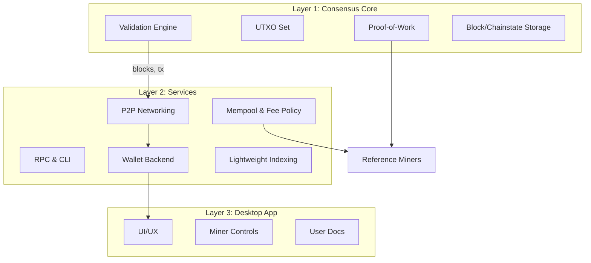

# DRACHMA Architecture

This document summarizes the layered architecture, boundaries, and design principles of DRACHMA (DRM).

## Layered Model

### Layer Boundaries

- **Layer 1 (Consensus):** Deterministic, versioned rules. No network policy, no UI logic. Outputs validated blocks, transactions, and UTXO state.
- **Layer 2 (Services):** Non-consensus. Responsible for network connectivity, mempool policy, RPC, and wallet operations. May be restarted or replaced without chain impact.
- **Layer 3 (Desktop):** User-facing, distribution-focused. Consumes RPC and wallet services; never enforces consensus.
- **Reference Miners:** Separate binaries using RPC/work submission; they do not embed consensus logic beyond header construction.

### Design Tenets

- **Minimalism:** Avoid unbounded programmability and governance mechanisms.
- **Auditability:** Clear data formats, deterministic validation, and reproducible builds.
- **Security:** Preference for well-studied primitives (SHA-256d, Schnorr) and minimal trusted surfaces.
- **Portability:** C++17 with careful dependency selection. GPU miners support CUDA/OpenCL where available.

### Data Flows

- Blocks/transactions enter via Layer 2, validated in Layer 1, and persisted.
- Wallets derive keys and construct transactions in Layer 2, using Layer 1 validation rules for signing.
- Miners fetch work templates via RPC, build candidate blocks, and submit solutions back to services for propagation.

### Release & Upgrade Strategy

- Consensus changes require explicit activation plans and broad review.
- Services and UI may iterate faster but must remain backward compatible with deployed nodes when possible.
- Releases should be reproducible and signed; see `docs/building.md` for deterministic build guidance.
